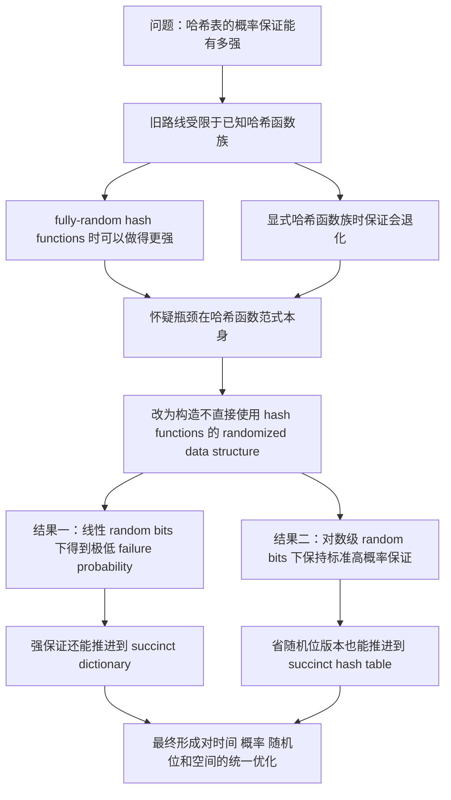

# 摘要阅读

## 一、摘要全文的中心问题

这篇论文的摘要开头就在问一个很核心的问题：

> This paper considers the basic question of how strong of a probabilistic guarantee can a hash table, storing $n$ $(1 + \Theta(1)) \log n$-bit key/value pairs, offer?

这里的重点不是“哈希表能不能做到常数时间”，而是：

- 它能以多大的概率做到常数时间；
- 为了得到这种概率保证，需要什么样的随机性；
- 这种保证是否受限于传统哈希函数框架。

所以，作者真正想讨论的是：

> 哈希表的能力边界，到底是“哈希表本身”的边界，还是“哈希函数范式”的边界？

## 二、逐段阅读摘要

下面按摘要原本的四个自然段来理解作者的思路。

### 第一段：先指出旧路线的瓶颈

摘要第一段说的是：

- 已有工作研究过“哈希表能提供多强的概率保证”这个问题；
- 但这类工作长期受到已知 hash function family 的限制；
- 如果允许 fully-random hash functions，那么可以把 failure probability 压得很低；
- 可是一旦改用已知的显式哈希函数族，同样的数据结构往往只能得到 `1 / poly(n)` 级别的 failure probability。

这一段的作用不是介绍结果，而是先告诉读者：

1. 这个问题不是新问题；
2. 过去已经有人想把 failure probability 做得很小；
3. 真正卡住大家的，不一定是“哈希表”这个目标本身，而是“通过现有哈希函数族来实现哈希表”这条技术路径。

我对这一段的理解是：

- 作者在主动制造一个“范式冲突”；
- 他暗示我们：如果旧方法的瓶颈一直来自 hash functions，那么也许应该怀疑“必须用 hash functions”这件事。

这一段读完之后，我最关心的问题变成了：

> 如果不用传统 hash function，哈希表还剩下什么本质结构？

### 第二段：给出核心突破口

摘要第二段是整篇论文最关键的一步：

- 作者说，他们构造了一个 randomized data structure；
- 这个结构在保证层面和 hash table 一样；
- 但它避免了 direct use of hash functions；
- 在此基础上，他们得到一个使用 $O(n)$ random bits 的哈希表；
- 它的 failure probability 达到
  $\frac{1}{n^{n^{1-\epsilon}}}$，
  其中 $\epsilon$ 是任意正常数。

这一段真正有分量的地方有两个。

第一，是观念上的突破：

- 作者不是说“我们找到了更好的 hash function family”；
- 而是说“我们绕开 hash functions，直接构造满足同类保证的数据结构”。

第二，是结果上的强度：

- $\frac{1}{\operatorname{poly}(n)}$ 已经是常见的 high probability 保证；
- 这里作者给的是远远更小的 failure probability；
- 说明他们追求的是一种极强的概率保证。

所以这一段其实完成了从“问题诊断”到“新路线提出”的转换：

- 旧路线：改进 hash functions；
- 新路线：绕过 hash functions，直接设计 randomized dictionary structure。

我在读这一段时最强烈的感受是：

> The paper first changes the implementation framework of the problem, and only then pushes the quantitative guarantee further inside that new framework.

### 第三段：把强保证推进到 succinct dictionary

摘要第三段很短，但很重要。它说：

- 上一段得到的强 failure probability guarantee；
- 不仅能在普通哈希表中做到；
- 还能在 succinct dictionary 中做到。

这里的意义在于，作者没有满足于“我们构造了一个很强但可能很费空间的结构”，而是继续追问：

- 在接近信息论最优空间的条件下；
- 能不能保留这种很强的概率保证？

这一步把两个通常会分别讨论的目标合并了：

1. 概率保证强不强；
2. 空间效率高不高。

我的理解是，这一段相当于在告诉读者：

> In fact, we show that this guarantee can even be achieved by a succinct dictionary, that is, by a dictionary that uses space within a $1 + o(1)$ factor of the information-theoretic optimum.

### 第四段：再给出另一个“相反方向”的结果

摘要第四段进一步说明，作者不只在“超低 failure probability”这一个方向发力。

这里他们又给出了另一个结果：

- 构造一个 succinct hash table；
- 它只使用 $\tilde{O}(\log n)$ random bits；
- 同时仍然提供 $\frac{1}{\operatorname{poly}(n)}$ 的 failure probability；
- 这个结果在保证级别上匹配了 Dietzfelbinger 等人的已有结果；
- 但空间效率更高，而且技术上也有新的成分。

这一段说明作者并不是只关心一个极端，而是在考察两个方向：

- 一个方向：给你足够多的 random bits，能把 failure probability 压到多低？
- 另一个方向：如果只给你很少的 random bits，还能保留多强的标准概率保证？

所以，摘要整体上展示的是两种极端优化：

1. 极低 failure probability；
2. 极少 random bits。

这使我觉得论文不只是一个单点结果，而更像是在建立一种新的设计框架，并展示这个框架在两个不同资源维度上的能力。

## 三、摘要的整体结构

如果把摘要压缩成一句话，它的逻辑是：

1. 旧方法卡在 hash functions 上；
2. 那就不要把哈希表等同于 hash functions；
3. 改为直接构造随机化 dictionary 结构；
4. 这样可以在两个方向上得到强结果：
   - 超低 failure probability；
   - 超省 random bits；
5. 而且这些结果还能与 succinctness 结合。

## 四、摘要思路图

下面这个 Mermaid 图概括了摘要中的推进路线：

## 五、我从摘要里读出的三个核心判断

### 1. 这篇论文首先是在挑战一个默认前提

这篇论文最重要的地方，不只是结果强，而是它挑战了一个传统默认前提：

> A hash table without hash functions.

作者的立场是：

- 哈希表的目标是实现 dictionary 的随机化常数时间保证；
- hash function 只是传统实现方式，而不一定是唯一方式。

### 2. 论文的核心资源观是“random bits 很宝贵”

从标题中的
*How to Get the Most Out of Your Random Bits*
就能看出来，作者不是把随机性当成无限资源。

他真正关心的是：

- 如果 random bits 多，可以换来多强的 failure guarantee；
- 如果 random bits 少，还能保住什么级别的 guarantee；
- 数据结构是否能高效地“消化”随机性，而不是浪费随机性。

### 3. 论文想同时处理三个指标

摘要反复围绕三个指标展开：

1. 时间：是否保持常数时间操作；
2. 概率：failure probability 能压到多低；
3. 空间：是否能做到 succinct。

所以后面读正文时，不能只盯着某个定理的尾界，还要一直看：

- 这个结构怎么用随机性；
- 为什么空间不会爆炸；
- 为什么它真的绕开了传统哈希函数瓶颈。

## 六、读完摘要后，我接下来最想追的五个问题

1. 作者说“避免直接使用 hash functions”，具体是怎样避免的？
2. 新结构到底如何完成传统哈希函数在 dictionary 中承担的工作？
3. 极低 failure probability 的关键技术障碍是什么，作者靠什么突破？
4. $O(n)$ random bits 版本和 $\tilde{O}(\log n)$ random bits 版本之间的关系是什么？
5. succinct 部分是重新设计出来的，还是在前面结构上做 transformation？

## 七、现阶段总结

仅从摘要来看，这篇论文之所以值得认真读，不只是因为它给了漂亮的数值结果，而是因为它提出了一个非常有研究味道的问题：

> 哈希表是否真的必须依赖哈希函数？

作者给出的回答方向是：

- 可以不把 hash functions 放在设计中心；
- 可以直接围绕“随机化 dictionary 保证”来构造结构；
- 并且这样做还能在 failure probability、random bits、succinctness 三个维度上得到很强的结果。

因此，后续正文阅读时，重点应该放在：

- 作者如何重新定义“哈希表设计”的核心对象；
- 以及这种重新定义如何带来新的技术可能性。
