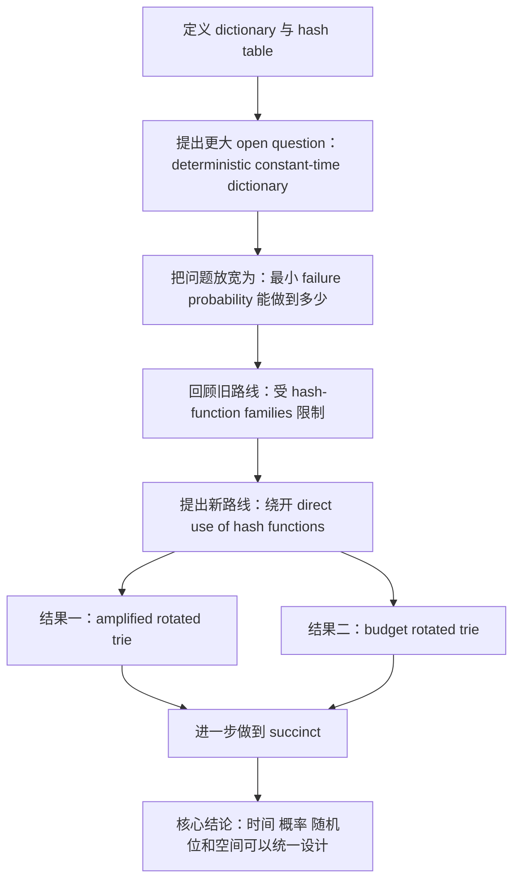

# 引言阅读

## 一、引言在整篇论文里的作用

这篇论文的 Introduction 不是单纯的背景铺垫，而是在很短的篇幅里完成了四件事：

1. 先把论文讨论的对象定义清楚；
2. 说明一个更大的 open question；
3. 把本文问题解释成那个 open question 的自然放宽；
4. 交代本文的主要结果、技术路线和章节安排。

所以，引言最重要的阅读方法不是逐句翻译，而是看作者如何一步步把读者带到这篇论文真正的问题上。

## 二、引言第一部分：先定义讨论对象

引言开头先定义什么是 `dictionary`，然后再说 randomized dictionary 通常也叫 `hash table`。

作者原文中最关键的两句是：

> A dictionary is any data structure that supports insertions, deletions, and queries on a set $S$ of up to $n$ keys.

以及

> Randomized dictionaries are often also referred to as hash tables.

这里有两个要点。

### 1. 作者先定义的是 dictionary，不是 hash table

这说明作者想把问题放在更一般的 dictionary data structure 框架下讨论，而不是直接沿用“哈希表就是一个带哈希函数的结构”这种通常理解。

这和论文标题是呼应的。标题已经暗示：

> 也许 hash table 的本质，并不在于 hash functions。

### 2. 作者对 hash table 的定义是刻意放宽的

引言脚注专门说了一点，大意是：

> 有时人们会把 hash table 非正式地定义为任何使用 hash functions 解决 dictionary 问题的方案；但本文刻意采用更开放的视角，把那些虽然不直接使用 hash functions、却完成了同样目标的数据结构也纳入讨论。

这个脚注其实非常重要，因为它相当于提前为整篇论文“正名”：

- 作者不是在玩文字游戏；
- 也不是在偷偷把“不是哈希表的东西”叫成哈希表；
- 而是在重新强调：如果某个结构实现了传统 hash table 的目标，那么它就值得被纳入 hash table 的讨论范围。

## 三、引言第二部分：从 deterministic constant-time dictionary 说起

引言接着提出一个更大的 open question：

> A central open question is whether there exists a deterministic constant-time dictionary.

作者随后说：

- Pătraşcu 和 Thorup 的 dynamic fusion node 在很小集合上给出了成功结果；
- 对于规模达到 $\Theta(n)$ 的 key 集合，人们广泛相信 deterministic constant-time dictionary 不存在；
- 但目前又缺乏足够强的 lower bounds 去真正证明这一点。

这一段的作用是建立论文的大背景：

- 真正理想的目标，其实是 deterministic constant-time dictionary；
- 但这个目标太强，至少现在还做不到；
- 所以研究者会转而考虑 randomized 版本。

这一步很关键，因为它解释了为什么本文关心的是 failure probability，而不是直接追求完全 deterministic 的常数时间。

换句话说，作者在这里完成了问题降级：

- 最高目标：deterministic constant-time dictionary；
- 现实目标：randomized dictionary 能否把 failure probability 压得非常低。

## 四、引言第三部分：提出本文研究问题

在上面的背景之后，作者给出本文的真正问题：

> In this paper, we consider a natural relaxation of this question: What is the smallest failure probability that a hash table can offer?

这句话是整篇引言最核心的过渡句。

它说明：

- 这篇论文不是直接解决 deterministic constant-time dictionary；
- 而是研究它的一个 “natural relaxation”；
- 也就是：如果允许随机化，那么 hash table 的失败概率最低能做到多少。

这里的思路非常自然：

1. deterministic 版本可能太难；
2. 那么就允许结构偶尔失败；
3. 接着研究失败概率能不能被压到极低。

作者随后直接点出两个卖点：

- 本文给出了第一个具有显著次多项式 failure probability 的 hash table；
- 而且这样的 hash table 甚至还能做成 succinct。

从写作上看，这里相当于先把贡献压缩成最短版本，让读者马上知道这篇论文“值不值得继续读”。

## 五、引言第四部分：回顾以往关于超强概率保证的工作

这一部分的小标题是：

> Past work on super-high-probability guarantees.

这段综述最重要的逻辑不是文献罗列，而是指出：

> 过去人们研究 hash table 的强概率保证时，几乎一直都被 hash-function families 所束缚。

作者的论证链条大致是：

1. 如果可以访问 fully-random hash functions，就能做到很强的 failure probability；
2. 但现实中需要显式构造、常数时间求值的 hash function family；
3. 已知的模拟技术本身又是 randomized constructions；
4. 它们会额外引入一个 $\frac{1}{\operatorname{poly}(n)}$ 的 failure probability；
5. 想继续压低这部分失败概率，通常又要付出 $\omega(1)$ evaluation time 的代价。

这段综述其实就是在给全文制造“技术瓶颈”的具体形状：

- 不是大家没想到要降低 failure probability；
- 而是传统做法一路追下去，最后会被 hash function 的实现与分析卡住。

作者还特别提到了 tabulation hashing：

- 这是已知常数时间 hash functions 中，唯一真正被成功用于得到 sub-polynomial failure probability 哈希表的一类；
- 但它目前能达到的最好量级仍然只是大约 $\frac{1}{2^{\operatorname{polylog} n}}$；
- 这也是作者要超越的 state of the art。

所以这一部分不是单纯说“前人做了什么”，而是在回答：

> 为什么本文必须换范式，而不能继续沿着旧范式小修小补？

## 六、引言第五部分：本文的第一个主要结果

这一部分标题是：

> This paper: hash tables with nearly optimal failure probabilities.

这里作者介绍的是 `amplified rotated trie`。

最重要的结论是：

- 它的 failure probability 可以做到
  $\frac{1}{n^{n^{1-\epsilon}}}$；
- 其中 $\epsilon > 0$ 是任意给定的正常数。

这已经远远强于通常意义上的 high probability。

更关键的是，作者紧接着解释了为什么这个结果“接近最优”：

> 如果存在 failure probability 为 $\frac{1}{n^{\epsilon n}}$ 的 hash table，那么将推出一个 deterministic constant-time dictionary 的存在。

这一步很重要，因为它说明作者不是随手给了一个很夸张的数值界，而是在论证：

- 这个结果距离真正能期待的最强界已经不远了；
- 再往上走，就会碰到 deterministic dictionary 这个更大的 open question。

所以这部分的意义不只是“给出一个新结构”，而是同时给出这个结构在理论位置上的解释。

## 七、引言第六部分：第二个主要结果与随机比特效率

接下来作者介绍第二个结果，也就是 `budget rotated trie`。

这个结果的焦点从 failure probability 转向 random bits：

- 它只使用 $\tilde{O}(\log n)$ random bits；
- 同时仍以 high probability 支持 constant-time operations。

这里作者在做一个很自然的“对偶”组织：

- 第一个结果：在允许用 $O(n)$ random bits 的前提下，尽量把 failure probability 压低；
- 第二个结果：在只保留标准 high probability 保证的前提下，尽量把 random bits 数量压低。

这说明作者不是只解决一个孤立问题，而是在探索两个资源维度之间的权衡：

1. failure probability；
2. random bits。

## 八、引言第七部分：为什么第二个结果也有意思

作者特别强调 `budget rotated trie` 的一个技术亮点：

- 它能够利用 “gradually-increasing-independence hash functions”；
- 这类 hash functions 过去最大的缺点，是 evaluation time 为 $\Theta((\log \log n)^2)$；
- 因而直接用于 classical hash tables 时，往往只能得到 $\omega(1)$ per-operation time。

作者的观点是：

> 这些 hash functions 过去不适合经典哈希表，不代表它们不适合别的 constant-time data structure 设计。

这和论文标题再次呼应：

- 如果你不把问题死死绑在传统 hash-table 范式上；
- 那么一些以前“看起来不合适”的随机工具，可能突然就能派上用场。

所以我觉得这一段传达的是一种方法论上的态度：

> 当旧范式限制了你，不一定是工具不行，也可能是你放置工具的框架不对。

## 九、引言第八部分：空间效率与 succinctness

接着作者把注意力转向空间效率，也就是：

> Achieving succinctness.

这里作者说明：

- 他们前面构造的数据结构不仅能给出强概率保证；
- 还可以在 key/value 长度为 $(1 + \Theta(1)) \log n$ 比特的参数区间内做成 succinct；
- 更一般地，他们给出一个 black-box transformation；
- 它可以把任意 dictionary 变成一个 succinct dictionary，同时几乎保留其随机化保证。

这里我认为最值得注意的是 “black-box transformation” 这句话。

这意味着：

- succinctness 不是只针对本文某一个特殊结构单独拼装出来的；
- 作者还试图抽象出一层通用转换机制。

这会让论文的贡献从“构造了两个新结构”上升到“给出了一种结构转换方法”。

## 十、引言第九部分：真正的核心观察

这一段标题是：

> Circumventing the hash-function bottleneck.

我认为这是整篇 Introduction 最值得反复看的部分。

作者在这里直说：

> it is possible to construct a hash table that does not use hash functions

并进一步说，这种做法因此摆脱了已知 hash-function constructions 所带来的限制。

随后作者介绍了整篇论文的起点：

- 先构造一个简单的 randomized dictionary；
- 它叫作 `rotated radix trie`；
- 它像标准 hash table 一样，使用线性空间，并且以 high probability 支持常数时间；
- 但它的随机性不是由 hash functions 提供，而是直接嵌入在数据结构内部。

这段几乎可以看作全文的“中心思想声明”。

如果让我用一句话概括引言最核心的思想，那就是：

> 这篇论文真正的创新，不只是提出了两个新结构，而是把“哈希表的随机性来源”从哈希函数转移到了数据结构内部。

## 十一、引言最后一部分：全文结构

最后作者用一段 `Outline` 简要说明全文安排：

- Section 2：预备知识与 convention；
- Section 3：rotated radix trie；
- Section 4：超低 failure probability 版本；
- Section 5：低 random bits 版本；
- Appendix A：扩展到更大 word size；
- Section 6：succinct transformation。

这一段虽然看起来只是目录说明，但它其实也透露了正文阅读的优先顺序：

1. 先理解 `rotated radix trie`；
2. 再看它如何被增强成两个方向的结果；
3. 最后再看 succinct 化。

所以从阅读策略上讲，我不应该一上来就盯 Section 6，而应该先把 Section 3 到 Section 5 的结构链条读明白。

## 十二、我对引言整体结构的理解

如果把整个引言压缩成一条主线，它大致是：

## 十三、我读完引言后的三个判断

### 1. 这篇论文的真正目标不是“改良哈希函数”

引言反复说明，作者不打算继续在 hash function family 上做局部修补，而是想直接绕过这个瓶颈。

所以这篇论文的关键词虽然还是 hash table，但它的思想重心已经更接近：

- randomized data structures；
- randomness as a resource；
- data-structure-internal randomization。

### 2. 这篇论文同时在组织两个层次的问题

引言其实同时在讲两个层次：

- 局部层次：如何构造具体数据结构并证明其界；
- 全局层次：哈希表的随机性到底该由什么提供。

后者正是这篇论文比单纯“一个更强上界”更有意思的地方。

### 3. 后续正文阅读的关键，不是只记结果，而是看结构链条

从引言看，后续阅读时最重要的不是只记住：

- failure probability 有多小；
- random bits 有多少；

而是要看下面这条结构链：

1. `rotated radix trie` 到底是什么；
2. 它为什么不需要传统 hash functions；
3. 它如何被放大成 `amplified rotated trie`；
4. 它如何被压缩成 `budget rotated trie`；
5. 它又如何进入 succinct transformation。

## 十四、接下来阅读正文时我最想追的问题

1. `rotated radix trie` 的随机性到底嵌在什么地方？
2. 它和传统 “先哈希再放桶” 的结构差异到底有多大？
3. `amplified` 和 `budget` 两个版本之间共享了哪些核心设计？
4. 为什么第二个结果能利用那些看起来 evaluation 很慢的 hash functions？
5. succinct 部分的 black-box transformation 具体是怎样连接前面结构的？

## 十五、现阶段总结

我觉得这篇论文的 Introduction 写得非常好，因为它没有直接把读者扔进技术细节，而是先完成了一次清晰的问题重构：

- 从 dictionary 出发；
- 提到 deterministic constant-time 的大 open question；
- 把本文问题表述成它的自然放宽；
- 说明旧路线卡在哪里；
- 再给出新路线和两个主结果。

因此，读完引言之后，我对这篇论文的理解可以暂时总结成一句话：

> 这篇论文不是单纯在问“哈希表能做到多强”，而是在问“如果不把哈希函数当作哈希表的中心部件，我们还能把哈希表做成什么样”。  
