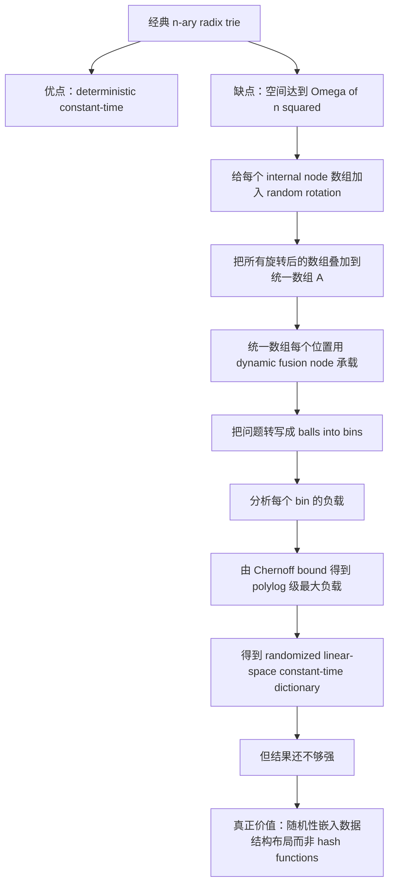

# Rotated Radix Trie 阅读

## 一、为什么这一节重要

Section 3 的标题是：

> A Warmup Data Structure: The Rotated Trie.

表面上看，它只是一个 “warmup”，但实际上它是整篇论文后续结构的共同起点。后面的：

- amplified rotated trie；
- budget rotated trie；
- 以及与 succinctness 相关的变换思路，

都建立在这一节提出的基本构造之上。

所以这一节最重要的阅读目标不是只记住 Proposition 1，而是弄清楚：

1. 作者到底把什么随机性放进了数据结构；
2. 这种随机性为什么不需要传统 hash functions；
3. 为什么它能在保留常数时间的同时，把空间从非常差的级别压回到线性空间。

## 二、这一节的整体结构

这一节的推进顺序很清晰：

1. 先从一个经典但空间很差的 $n$-ary radix trie 出发；
2. 给每个 internal node 的数组加一个随机 rotation；
3. 把所有旋转后的数组“叠”到一个统一数组里；
4. 分析叠加后每个位置会不会太拥挤；
5. 证明以高概率不会太拥挤，因此得到线性空间常数时间结构；
6. 最后说明这个结构本身还不够强，但它揭示了一个关键设计思想：
   随机性可以直接嵌入数据结构内部，而不必来自 hash functions。

## 三、起点：经典的 $n$-ary radix trie

作者的起点是一个非常标准的对象：

> The starting place for our data structure will be the classic $n$-ary radix trie.

它的基本结构是：

- 每个 internal node 都对应一个大小为 $n$ 的数组；
- 第 $j$ 个位置存向 child $j$ 的指针，如果没有这个 child 就存空；
- 叶子对应当前存储的 keys；
- values 放在叶子处。

如果一个 key 被拆成
$j_1 \circ j_2 \circ \cdots \circ j_d$，
那么它就在 trie 中对应一条 root-to-leaf path：
$j_1, j_2, \ldots, j_d$。

### 这一结构的优点

作者明确指出它的一个优点：

> the trie deterministically supports constant-time operations

这很好理解，因为：

- 每一步只是在一个大小为 $n$ 的数组中按索引跳一次；
- 如果 word size 和 key/value 长度本身都是 $\Theta(\log n)$，那么每次访问都可以看作常数时间。

### 这一结构的致命问题

问题在空间上。

作者说：

- internal nodes 的数量可能达到 $\Theta(n)$；
- 每个 internal node 又都是大小为 $n$ 的数组；
- 所以总空间可能达到 $\Omega(n^2)$。

这就是后面所有改造的出发点：

> 保留 radix trie 的“确定性常数时间查找骨架”，但想办法摆脱它的平方级空间浪费。

## 四、核心想法：给每个 node 的数组做随机 rotation

作者的第一步改造很简单，但非常关键。

他把 trie 的 internal nodes 编号为
$1, 2, \ldots, m$，
并把第 $i$ 个 internal node 对应的数组记作 $A_i$。

然后对每个 node $i$，随机选一个 rotation
$r_i \in \{0,1,\ldots,n-1\}$。

其作用是：

- 原来应该放在 $A_i[j]$ 的内容；
- 现在改放到
  $A_i[(j + r_i) \bmod n]$。

### 这一步在直觉上做了什么

这一步并没有改变 trie 的逻辑结构，只是把每个数组的非空位置做了一个随机循环平移。

所以它的作用不是“改变查询规则”，而是：

> 把每个 internal node 的稀疏占用模式随机打散。

这样后面如果想把多个数组压到同一块空间里，碰撞就有希望被随机性稀释掉。

## 五、真正的压缩：把所有数组叠到一个统一数组里

有了随机 rotation 后，作者做了最重要的一步：

> overlay the arrays $A_1, A_2, \ldots, A_m$ on top of one another

也就是说：

- 不再真的给每个 internal node 单独开一个大小为 $n$ 的数组；
- 而是把所有旋转后的数组叠加到一个统一数组 $A$ 上；
- 这个统一数组本身大小只有 $n$。

当然，这立刻带来一个问题：

- 同一个位置 $A[j]$ 可能同时承载多个不同数组的元素；
- 如果太多元素都压到同一个位置，就没法常数时间处理。

作者的解决方式是：

- 把统一数组 $A$ 的每个位置实现成一个 dynamic fusion node；
- 只要每个位置需要承载的元素数不超过
  $\ell = \operatorname{polylog} n$，
  就仍能常数时间处理。

所以整个构造的关键就变成：

> 叠加之后，每个位置里究竟会堆多少条目？

## 六、作者如何重新描述这个结构

为了便于分析，作者引入了两个非常有用的视角：

### 1. 把 internal nodes 看成 nodes

数组
$A_1, A_2, \ldots, A_m$
就是 trie 的 nodes。

### 2. 把每个非空条目看成 balls

每个非空条目，也就是本来存一个 pointer 的位置，被称为一个 ball。

这样整个问题就被转写成了一个 balls-into-bins 的问题：

- 一个 ball 对应某个 node 中的一个非空条目；
- 统一数组 $A$ 的每个位置是一个 bin；
- 随机 rotation 决定每个 ball 被送到哪个 bin。

我觉得这是这一节最漂亮的一步，因为它把一个数据结构问题转成了一个非常经典的随机分配问题。

## 七、balls-to-bins 映射是如何定义的

作者把每个 ball 记成一对
$(s,c)$：

- $s \in [m]$ 是 source node；
- $c \in [n]$ 是 child index。

随机 rotation 的效果就是：

- ball $(s,c)$ 被映射到
  $\phi(s,c) := c + r_s$
  对应的位置。

然后把统一数组 $A$ 的位置称为 bins，
于是每个 ball 就落到某个 bin 里。

从这里开始，整个分析的焦点都变成：

> 固定一个 bin $j$，到底有多少个不同 source nodes 会把 ball 送到这里？

## 八、为什么能用 Chernoff bound

作者定义
$X_{i,j}$ 为一个 $0$-$1$ 随机变量，表示：

- node $i$ 是否向 bin $j$ 放入了一个 ball。

最关键的观察是：

- 对不同的 bins，变量之间并不独立；
- 但对不同的 nodes，变量是独立的；
- 因为每个 $X_{i,j}$ 只依赖于这个 node 自己的随机 rotation $r_i$。

于是，对于固定 bin $j$，

$$
Y_j = \sum_{i=1}^{m} X_{i,j}
$$

就是一组独立指示变量之和。

再加上：

- 整个 trie 总共有 $O(n)$ 个 balls；
- 每个 ball 落到固定 bin $j$ 的概率是 $\frac{1}{n}$；

所以有

$$
\mathbb{E}[Y_j] = O(1).
$$

于是可以直接用 Chernoff bound 推出：

- 以高概率，
  $Y_j \le \operatorname{polylog} n$；
- 更强一点，失败概率甚至可以做到
  $\frac{1}{n^{\operatorname{polylog} n}}$。

这说明统一数组的每个位置只需要处理很少的条目，因此 dynamic fusion node 足够胜任。

## 九、这一节最后得到什么结论

作者因此得到 Proposition 1：

> The rotated radix trie is a randomized linear-space dictionary that can store up to $n$ $\Theta(\log n)$-bit keys/values at a time, and that supports each operation in constant time with probability $1 - 1/n^{\operatorname{polylog} n}$.

也就是说，这个结构已经实现了：

1. 线性空间；
2. 常数时间操作；
3. 很强但还不是极限级别的 failure probability。

而且作者还补充说明：

- 随机 rotations 可以 lazy initialize；
- 数组可以用 zero-initialized array 的经典技巧模拟；
- 所以初始化时间也能做到常数。

这点很重要，因为很多理论结构会忽略 initialization，而作者这里刻意强调它也保持在常数时间。

## 十、为什么这个结构还“不够”

作者并没有把 rotated radix trie 当作最终结果，而是很明确地说：

它本身并没有真正解决论文最关心的两个问题：

1. super-high probability guarantees；
2. near-logarithmic number of random bits。

原因很直接：

- 它虽然已经把 failure probability 做成了略微次多项式；
- 但距离
  $\frac{1}{n^{n^{1-\epsilon}}}$
  还很远；
- 而它使用的 random bits 也远没有压到接近对数级。

所以这一节的地位不是“最终结构”，而是“后续两个结果的共同原型”。

## 十一、这一节真正留下来的思想遗产

作者最后强调，这个结构真正有价值的地方在于：

> The only sources of randomness are the rotational offsets $r_1, r_2, \ldots, r_m$.

这句话非常重要。

因为在传统 hash table 中，随机性通常体现在：

- 先用 hash function 把元素映射到位置；
- 再围绕这个映射做装载和平衡。

但在 rotated radix trie 中：

- 随机性不是用来 hash elements；
- 而是用来对稀疏数组做 random rotations。

所以它展示了一种非常不同的随机化方式：

> 随机性可以直接嵌入数据结构内部布局，而不是通过显式 hash function 中介来发挥作用。

这也是后面 amplified rotated trie 和 budget rotated trie 能成立的根本原因。

## 十二、作者最后提醒的一个 subtlety

这一节最后还有一个很值得注意的点：

- 数据结构随着时间变化；
- trie 的形状会变化；
- 每个数组 $A_i$ 在不同时刻可能被重新拿去表示 trie 的不同部分；
- 因而同一个随机 rotation $r_i$ 在不同时间点，会作用在不同的 key-space 区域上。

作者想强调的是：

> 随机性不是静态绑定到某个固定语义位置上的，而是会随着结构演化被重新用途化。

这件事在后续分析里会变得很重要，因为它说明：

- 即使两个时刻存储的是完全相同的一组 keys；
- 对应的 trie 形状也可能不同；
- 同一批 random bits 的“作用对象”也会不同。

## 十三、我对这一节的理解

如果只用一句话概括这一节，我会说：

> rotated radix trie 的核心不是“发明了一个新 trie”，而是把“多个稀疏数组如何共享一块空间”这个问题随机化了。

更具体地说，这一节完成了三个层次的工作：

1. 保留 radix trie 的常数时间导航能力；
2. 用 random rotation 把空间压缩问题转成 balls-into-bins 问题；
3. 由此展示一种“随机性内嵌于结构布局”的哈希表设计思路。

## 十四、这一节的思路图

## 十五、这一节之后我最想继续追的问题

1. 为什么 rotated radix trie 只能得到“略微次多项式”的 failure probability？
2. amplified rotated trie 是在哪一步把这个概率大幅压下去的？
3. budget rotated trie 又是如何把 random bits 从很多压到很少的？
4. 后面两个结构到底继承了 rotated radix trie 的哪些核心骨架？

## 十六、现阶段总结

我觉得这一节是整篇论文最值得认真啃透的地方之一，因为它第一次具体展示了：

- 什么叫 “a hash table that does not use hash functions”；
- 随机性如何直接服务于结构布局；
- 为什么旧问题可以被重新表达成一个新的随机组合问题。

如果这一节没读懂，后面的 amplified 和 budget 两条线大概率都会变成“只记结论，不懂机制”。  
