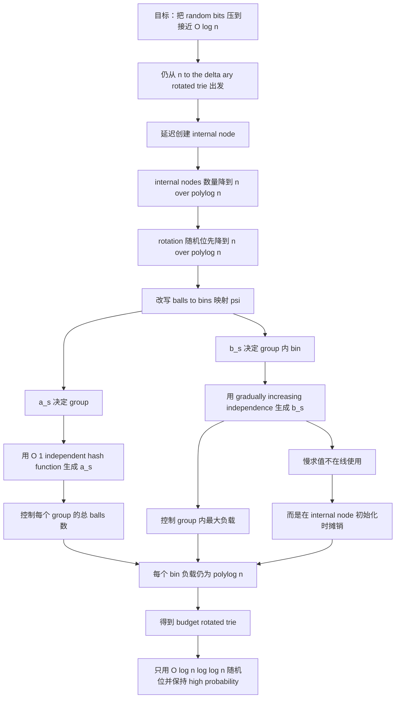

# Budget Rotated Trie 阅读

## 一、这一节要解决什么问题

Section 4 的 `amplified rotated trie` 已经把 failure probability 压到了非常夸张的级别：

$$
\frac{1}{n^{n^{1-\epsilon}}}.
$$

但它仍然要用 $O(n)$ random bits。

所以 Section 5 换了一个优化方向：

> 不再继续极限压低 failure probability，而是尽量压低 random bits 的使用量。

作者开头写得很直接：

> In this section, we present a dictionary that uses only $O(\log n \log \log n)$ random bits, while guaranteeing that each operation takes constant time with probability $1 - 1 / \operatorname{poly}(n)$.

这说明这一节关注的是一个“资源对偶”：

- Section 4：多用随机位，换极低失败概率；
- Section 5：接受标准 high probability，换极少随机位。

## 二、这一节在整篇论文结构中的位置

引言里作者已经明确说过，第二个结果是第一个结果的一个“自然对偶”。

因此读这一节时，最好始终带着一个比较视角：

1. 它和 `amplified rotated trie` 哪些地方相同；
2. 它为了省随机位，哪些地方做了额外修改；
3. 为什么这些修改不会把常数时间性质破坏掉。

从正文看，Section 5 的起点依然是 rotated trie，而且和 Section 4 一样，也把 fanout 取成 $n^\delta$。作者甚至明确说，取 $\delta = 1/4$ 就够了。

这意味着：

> Section 5 不是另起炉灶，而是在同一条 rotated-trie 技术线上继续做资源压缩。

## 三、第一步修改：把 internal node 的数量降到 $n / \operatorname{polylog} n$

作者的第一项重要修改，不是先改随机源，而是先改 internal node 何时创建。

在原始 rotated trie 里，每个 ball 通常要么指向：

- 一个 leaf；
- 或另一个 internal node。

现在作者加入第三种状态：

- 如果某个本来该指向 internal node $x$ 的 ball，发现以 $x$ 为根的子树目前元素还很少，不到 $\ell = \operatorname{polylog} n$；
- 那么先不真正创建 internal node $x$；
- 而是先用一个 dynamic fusion node $z$ 代理这棵小子树。

作者原文是：

> We now add a third option ...

以及：

> we only create a new internal node $x$ if the subtree rooted at $x$ contains at least $\ell = \operatorname{polylog} n$ elements.

这一步的意义非常大，因为它直接控制了 internal nodes 的总数 $m$：

$$
m \le O(n / \ell) = n / \operatorname{polylog} n.
$$

于是，如果仍给每个 internal node 配一个 rotation，那么所需随机位数立刻从 $O(n \log n)$ 降成：

$$
O\left(\frac{n}{\operatorname{polylog} n}\right).
$$

作者自己也承认，这看起来还远没有到目标，但这是关键过渡。

## 四、第二步修改：彻底改变 balls-to-bins 的映射方式

在标准 rotated trie 中，ball $(s,c)$ 被送到：

$$
\phi(s,c) = (c + r_s) \bmod n.
$$

Section 5 改成了新映射：

$$
\psi(s,c) = \left((c + a_s) \bmod n^\delta\right)\cdot n^{1-\delta} + b_s.
$$

这里：

- $a_s \in [n^\delta]$；
- $b_s \in [n^{1-\delta}]$。

作者对这个映射的解释很值得抓住。可以把全部 bins 划成 $n^\delta$ 个 groups：

$$
G_1, G_2, \dots, G_{n^\delta},
$$

每个 group 的大小是 $n^{1-\delta}$。

那么：

- $a_s$ 决定某个 ball 被送到哪个 group；
- $b_s$ 决定它在这个 group 内落在哪个 bin。

最关键的一点是：

> 同一个 source node 的不同 balls，不会被送到同一个 group 中的两个位置再发生内部竞争。

作者原文是：

> the assignments are designed so that each source node $s$ assigns at most one of its balls to any given group $G_i$.

这一点是后面分析能够分层进行的关键。

## 五、为什么要拆成 $a_s$ 和 $b_s$ 两层随机性

这一节最值得学的设计，是作者没有再追求“一把随机映射全做完”，而是把问题拆成两层：

1. 先控制每个 group 里会进来多少 balls；
2. 再控制 group 内部的最大负载。

于是：

- $a_s$ 负责 group-level balancing；
- $b_s$ 负责 within-group balancing。

这样的拆分非常重要，因为它允许作者分别用两种不同等级的随机工具，而不是要求同一种 hash family 同时解决所有问题。

## 六、如何生成 $a_s$：只需要 $O(1)$-independent hash functions

作者先处理较容易的一层，也就是 $a_s$。

他选一个 $k$-independent hash function：

$$
g : [n] \to [n^\delta],
$$

然后设：

$$
a_i := g(i).
$$

因为 $k = O(1)$，所以：

- 这个函数只需要 $O(\log n)$ random bits 描述；
- 可以在 $O(1)$ 时间求值。

然后作者用 $k$-wise independent tail bound 去证明每个 group $G_i$ 的 balls 总数不会太大。

定义事件：

$$
X_j = \mathbf{1}[\text{source node } j \text{ sends a ball to } G_i].
$$

由于这些变量是 $k$-independent，作者可以调用 Lemma 4，推出：

$$
\Pr\left[|G_i| - \mathbb{E}[|G_i|] \ge n^{0.75}\right] \le \frac{1}{\operatorname{poly}(n)}.
$$

再结合 $\delta = 0.25$，得到：

$$
\Pr\left[|G_i| \le O(n^{1-\delta})\right] \ge 1 - \frac{1}{\operatorname{poly}(n)}.
$$

也就是说，每个 group 的总 balls 数以高概率都是可控的。

## 七、如何生成 $b_s$：引入 gradually-increasing-independence hash functions

更难的是 group 内部的负载控制。

这里作者引入了一类很特别的工具：

> gradually-increasing-independence hash functions.

作者把它们定义成一类 `load-balancing` family $H(t)$，能把 $t$ 个 balls 映射到 $t$ 个 bins，并以高概率保证最大负载只有 $\operatorname{polylog} t$。

更具体地，这类函数有三个性质：

- 只用 $O(\log t \log \log t)$ random bits；
- 最大负载很好；
- 但求值时间不是常数，而是超常数。

作者原文写得很坦白：

> The family $H$ comes with a tradeoff.

以及：

> The super-constant evaluation time makes it so that hash functions with gradually-increasing independence are not suitable for direct use in constant-time hash tables.

这其实就是老问题：如果你把这类函数当普通哈希函数直接放进经典哈希表，每次操作都得慢下来。

## 八、这一节最巧的转折：不把它当 hash function，用它当伪随机数生成器

这一步我觉得是 Section 5 最漂亮的点。

作者没有把 $h$ 当作“每次查询都要在线求值的 hash function”，而是只把它当成初始化随机参数的工具。

具体来说，选：

$$
h : [m] \to [n^{1-\delta}]
$$

并设：

$$
b_i := h(i).
$$

作者原文点得非常清楚：

> We get around this problem by using $h$ not as a hash function but as a pseudo-random number generator.

这句话几乎就是这一节的灵魂。

因为一旦角色变了，代价模型也变了：

- 如果每次操作都要算 $h(i)$，那它太慢；
- 但如果某个 internal node 只在创建时初始化一次 $b_i$，那慢一点是可以摊掉的。

## 九、为什么超常数初始化时间不会破坏常数时间操作

这是这一节最需要解释清楚的地方。

作者说，$h(i)$ 的计算时间大约是：

$$
O((\log \log n)^2).
$$

表面看，这已经不是常数时间了。

但作者前面已经安排好了结构：

- 一个 internal node 不是立刻创建；
- 只有当对应子树里积累了至少 $\ell = \operatorname{polylog} n$ 个元素时，才真正创建。

因此：

- internal node 的初始化成本，可以分摊到触发它创建的那 $\ell$ 次操作上；
- 而只要

$$
\ell = \omega((\log \log n)^2),
$$

这种摊销就是安全的。

作者原文总结为：

> Since $\ell = \omega((\log \log n)^2)$, we can initialize $b_i = h(i)$ without any problem.

这一步非常关键，因为它说明作者不是“无视了慢求值”，而是重新设计了时机，让慢求值只出现在可摊销的初始化阶段。

## 十、最大负载分析是如何完成的

前面两层随机设计合起来后，分析就变得很顺：

第一层：

- 以高概率，每个 group $G_i$ 只含有 $O(n^{1-\delta})$ 个 balls。

第二层：

- 在同一个 group 里，这些 balls 来自不同的 source nodes；
- 如果一个 ball 的 source node 是 $s$，那么它被放到该 group 的第 $b_s$ 个 bin；
- 因此 group 内部的负载就是

$$
g_{i,r} = |\{s \in S_i \mid h(s) = r\}|.
$$

这里 $S_i$ 是送球到 group $G_i$ 的 source-node 集合。

而因为 $h$ 来自 load-balancing family，所以以高概率有：

$$
g_{i,r} \le \operatorname{polylog}(n).
$$

于是每个 bin 里 balls 的数量仍然只是 $\operatorname{polylog}(n)$ 级别，dynamic fusion node 依然可以处理。

## 十一、这一节得到的正式结论

作者于是得到 Theorem 5：

> The budget rotated trie is a randomized linear-space dictionary ...

其核心保证是：

- 线性空间；
- 存储最多 $n$ 个 $\Theta(\log n)$-bit key/value pairs；
- 只用

$$
O(\log n \log \log n)
$$

random bits；

- 每次操作以

$$
1 - \frac{1}{\operatorname{poly}(n)}
$$

的概率在常数时间内完成。

这就是摘要最后一段提到的那个“另一端”的结果。

## 十二、为什么作者说这个结果在某种意义上也是最优的

这一节结尾给出 Lemma 6，意思是：

如果存在一个线性空间 dictionary：

- 只用 $c \log n$ random bits；
- 失败概率却比 $\frac{1}{n^c}$ 还小；

那么就能推出一个 deterministic linear-space constant-time dictionary。

作者证明很短，但意思很强：

- 既然随机位只有 $c \log n$，那全部可能的随机串总数只有 $n^c$；
- 如果每个随机串都在某个操作序列上失败，那平均失败概率至少是 $\frac{1}{n^c}$；
- 所以若失败概率严格小于这个界，必有某个固定随机串对所有序列都成功；
- 把这个随机串硬编码进去，就得到 deterministic dictionary。

因此，这一节想表达的不是“我们碰巧做到了一个不错的界”，而是：

> 在如此少的随机位预算下，standard high probability 已经接近你还能期待的最好结果。

## 十三、这一节最该记住的思想

我觉得 Section 5 最值得记住的，不是定理本身，而是下面这条方法论：

1. 不要把所有随机性需求都压给一个统一 hash function；
2. 先把负载均衡问题拆层；
3. 为不同层分别选择不同强度的随机工具；
4. 对慢工具，不要在线用，而要挪到可摊销的初始化阶段。

这是一种非常“数据结构化”的随机设计思路。

它不是在问：

> 有没有一个完美 hash function 一次性解决一切？

而是在问：

> 数据结构的不同局部，到底各自需要什么强度的随机性？这些随机性又能在哪个时机付费最划算？

## 十四、这一节和 Section 6 的衔接

Section 5 还有一个容易被忽视但其实很重要的作用：

它不只是给出第二个主结果，还为 Section 6 的 succinct transformation 准备了一个关键组件。

正文中作者明确说：

> the specific structure of the budget rotated trie will prove useful in our quest for succinctness in Section 6.

也就是说，`budget rotated trie` 不只是“另一个结果”，还是后面做 succinct 化时的重要零件。

## 十五、Mermaid 结构图

## 十六、接下来读 Section 6 时要带着的问题

下一节最值得继续追的几个问题是：

1. 作者如何把“线性空间但非 succinct”的 dictionary 统一转成 succinct dictionary？
2. 为什么 many-sets problem 是这个转化里的正确中间层？
3. Section 5 的 `budget rotated trie` 为什么会在 Section 6 里再次成为关键组件？
4. 论文最终的 succinct 结果，究竟是“再造一个全新结构”，还是“在已有结构外再包一层转换”？

## 十七、简短总结

Section 5 的核心贡献，是把 rotated-trie 路线从“强概率保证”推进到“随机位极省”的另一极端。作者通过延迟创建 internal node、把 balls-to-bins 映射拆成 group-level 和 within-group 两层，并把 slowly-evaluable 的 gradually-increasing-independence hash functions 只用于初始化阶段，而不是在线查询阶段，最终实现了只用 $O(\log n \log \log n)$ random bits 的线性空间 constant-time dictionary。它既是第二个主结果，也是后续 succinct 化的重要铺垫。
