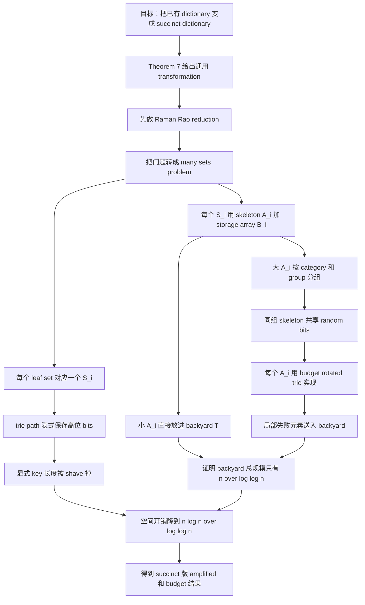

# Achieving Succinctness 阅读

## 一、这一节为什么重要

前面几节已经给了两条主结果线：

- `amplified rotated trie`：把 failure probability 压到极低；
- `budget rotated trie`：把 random bits 压到极少。

但这两条结果有一个共同限制：

> 它们都只是线性空间意义下的好结构，还不是 succinct。

所以 Section 6 的任务不是再去优化时间或随机性，而是把问题切换到：

> 能不能在几乎达到 information-theoretic optimum 的空间里，保留前面那些概率保证？

作者开头直接说：

> we will prove a much more general result: that any constant-time dictionary can be transformed into a succinct constant-time dictionary

这句话非常关键，因为它说明这一节不是只给前文某个结构做专门压缩，而是试图给出一个通用变换。

## 二、succinct 在这里到底是什么意思

这一节里，作者设：

- 每个 key 长度为 $c_1 \log n$ 比特；
- 每个 value 长度为 $c_2 \log n$ 比特；
- $c = c_1 + c_2 > 1$。

目标空间写成：

$$
(1 + o(1)) \mathcal{B}(|U|, n)
$$

在正文里又具体化为：

$$
cn \log n - n \log n + o(n \log n).
$$

这可以理解成：

- 原始存储所有 key/value 的“显式线性空间”大约是 $\Theta(n \log n)$；
- 但真正从信息论角度看，冗余可以被压掉一大块；
- succinct 的目标就是把多余部分压到低阶项。

所以这一节不是在做常数级改进，而是在追求：

> 空间表达方式本身的升级。

## 三、这一节的主定理在说什么

作者把已有结构抽象成一个

$$
(r(n), p(n), s(n))\text{-dictionary}
$$

意思是它：

- 使用 $O(r(n))$ random bits；
- 每次操作 failure probability 为 $O(p(n))$；
- 空间为

$$
cn \log n - n \log n + O(s(n)).
$$

然后主定理 Theorem 7 说：

> 给定一个 $(r(n), p(n), n \log n)$-dictionary，可以构造出一个更 succinct 的 dictionary。

新结构满足：

$$
r'(n) = r(n) + (\log p(n)^{-1}) \cdot (\log \log n)^3,
$$

$$
p'(n) = p(n / \log \log n),
$$

$$
s'(n) = \frac{n \log n}{\log \log n}.
$$

这三行式子值得分别理解：

1. 随机位只增加了一个相对温和的附加项；
2. failure probability 基本保住了，只是参数里把 $n$ 缩成了 $n/\log\log n$；
3. 空间冗余从 $n \log n$ 量级压到了

$$
\frac{n \log n}{\log \log n},
$$

也就是低阶项。

所以这一节真正的成就是：

> 不需要重做前面的概率结构，只要把它们包进一个 succinct transformation，就能继承出 succinct 版本。

## 四、这一节的总体证明路线

作者没有直接证明 Theorem 7，而是分两步走：

1. 先用 Raman-Rao reduction，把 succinct dictionary 问题转成 `many-sets problem`；
2. 再证明 many-sets problem 可以用前文的数据结构工具解决。

这意味着：

> Section 6 的核心不是单个新数据结构，而是一个 reduction 加一个实现。

## 五、many-sets problem 是什么

作者引入参数 $\delta > 0$，定义 many-sets problem：

- 有动态变化的集合

$$
S_1, S_2, \dots, S_m,
$$

- 满足

$$
\sum_i |S_i| = n,
$$

$$
m \le \frac{n}{\operatorname{polylog}(n)},
$$

$$
|S_i| \le n^\delta.
$$

每个 $S_i$ 存的是 $O(\log n)$-bit key/value pairs，但不同集合里的 key/value 位长可以不同，记为 $\gamma_i = O(\log n)$。

需要支持的操作只是：

- `INSERT(i, x, y)`
- `DELETE(i, x)`
- `QUERY(i, x)`

而一个 many-sets solution 的空间要求是：

$$
\sum_i |S_i| \cdot (\gamma_i + O(\log |S_i|)) + s(n).
$$

这个形式一开始看起来有点怪，但其实正是为了后面“局部集合大小越小，额外索引成本越低”这件事服务。

## 六、为什么从 succinct dictionary 会自然降到 many-sets

作者引用 Raman and Rao 的 reduction，并补了一段非常值得看的高层解释。

核心做法是造一棵 trie，但这棵 trie 的用法和前文非常不同。

这里 trie 的作用不是做负载均衡，而是：

1. 按前缀把元素分到很多小集合中；
2. 借 trie path 隐式保存高位比特；
3. 从而把每个叶子集合中元素的显式 key 长度削短。

作者原文里最关键的一句是：

> the trie allows for us to shave bits off of keys

这句话几乎就是整个 reduction 的核心。

如果某个内部节点 fanout 是 $f$，那么进入其子节点的元素就可以少显式存 $\log f$ 个高位比特，因为这些比特已经由 trie 路径隐式编码了。

于是到了叶子集合 $S_i$，每个元素显式保留的 key/value 比特数就下降成：

$$
\gamma_i \le c \log n - \log n - q \log |S_i| + O(\log \log n).
$$

这就是为什么后面 many-sets problem 允许每个元素额外再花 $O(\log |S_i|)$ 比特做局部索引。

## 七、为什么约束是 $m \le n / \operatorname{polylog}(n)$ 且 $|S_i| \le n^\delta$

这一节还专门解释了 many-sets problem 那两个看似突然出现的约束。

第一个约束：

$$
m \le \frac{n}{\operatorname{polylog}(n)}
$$

来自 trie 内部节点 fanout 的选择。内部节点 fanout 取成

$$
r / \operatorname{polylog}(n),
$$

其中 $r$ 是该节点包含的元素数。由于 trie 深度是常数，总叶子数自然不会太多。

第二个约束：

$$
|S_i| \le n^\delta
$$

来自“被 shave 掉的比特数不能超过所有显式比特”这个事实。若某个叶子集合太大，那么沿 root-to-leaf path 一路 shaving bits，最后会把所有 bits 都剃光，矛盾。

所以这两个条件不是附会出来的，而是 reduction 本身自然逼出来的结构边界。

## 八、Raman-Rao 原始 many-sets 解法的长处和短板

作者先回顾 Raman and Rao 的基础方案，它把每个 $S_i$ 存成两部分：

- skeleton $A_i$
- storage array $B_i$

其中：

- $B_i$ 连续存放真实 key/value；
- $A_i$ 是一个 dictionary，把元素的短 hash 映射到它在 $B_i$ 中的位置。

作者原文是：

> each $S_i$ is stored in a two-part structure, consisting of a skeleton $A_i$ and a storage array $B_i$.

这个设计的好消息是：

- 在 skeleton 里，keys 是 $\Theta(\log |S_i|)$-bit hash；
- values 只是 $B_i$ 里的索引；
- 所以 skeleton 完全可以用普通线性空间 dictionary 做，不用管 succinct。

坏消息是，两类失败都可能发生：

1. hash collision；
2. 用来实现 skeleton 的 dictionary 本身失败。

如果 skeleton 的失败概率只有

$$
1 / \operatorname{poly}(|S_i|),
$$

那当某些 $|S_i|$ 很小时，这个概率其实并不够强。所以 Raman-Rao 原方案只能给 constant expected time，而不是 high probability。

这正是本论文切入的地方：

> 前人 reduction 已经把 succinct 问题降对了，但最后那一步局部 dictionary 的概率保证还不够强。

## 九、Section 6.2 的总思路：继续用 skeleton/storage-array，但把失败元素送进 backyard

作者在 Proposition 11 里说明，他要改造 Raman-Rao 方案。

主意是：

1. 仍然保留每个 $S_i$ 的 skeleton $A_i$ 和 storage array $B_i$；
2. 把 $A_i$ 用 `budget rotated trie` 来实现；
3. 但不要求每个 $A_i$ 永远成功；
4. 一旦某次插入在某个 $A_i$ 中失败，就把这个元素扔到一个全局备用结构 `backyard` 里。

作者原文写得很清楚：

> We then store the elements that experience failures in a backyard data structure ...

这一步非常关键，因为它把“局部失败事件”变成了“少量异常元素外流到全局备用仓”。

所以 Section 6 的核心思想不是“绝不失败”，而是：

> 允许局部 skeleton 偶发失败，但必须证明失败元素总数始终很少。

## 十、backyard 是怎么工作的

作者定义了一个全局 dictionary $T$，叫 backyard。

它的职责是：

- 存放那些在某个 skeleton $A_i$ 中插入失败的元素；
- 以及所有过小的集合对应的元素。

$T$ 直接用给定的

$$
(r(n), p(n), n \log n)\text{-dictionary}
$$

实现。

但要想满足最终 succinct 目标，就必须证明：

$$
|T| \le O(n / \log \log n)
$$

以高概率成立。

因为只要 backyard 的元素规模被控在这个量级，它带来的总空间额外开销才仍然是低阶项。

## 十一、为什么小 skeleton 可以直接全扔进 backyard

作者先取一个足够大的常数 $c$，然后把所有满足

$$
a_i \le \log^c n
$$

的 skeleton 对应元素直接放进 backyard。

这里 $a_i$ 是 skeletal size，也就是最近一次重建 skeleton 时的大小。它始终满足：

$$
a_i = \Theta(|S_i|),
$$

但只有在重建时才改变，这样分析方便很多。

小 skeleton 全扔进 backyard 的原因是：

- 这类集合很多也没关系，因为每个都很小；
- 总贡献量仍然是低阶项；
- 反而能避免在极小集合上追求过强概率保证。

这是一个很典型的“不要为小对象过度设计”的做法。

## 十二、真正困难的部分：如何共享随机位又不让失败堆积

这部分是 Section 6 最巧的地方。

作者把剩余的 $A_i$ 按 skeletal size 分成 category $j = \lfloor \log a_i \rfloor$，然后在每个 category 内再切成若干组：

$$
G_{j,1}, G_{j,2}, \dots, G_{j,t_j}.
$$

这里

$$
t_j = (\log \log n)^2 \cdot \log p(n)^{-1} / j.
$$

切组的目标是双重的：

1. 同一组内的多个 $A_i$ 共享同一批 random bits；
2. 不同组之间彼此独立。

这样一来：

- 总 random bits 可以大幅复用；
- 但 backyard 里来自不同组的失败元素数仍然可以用独立性做 concentration。

这正是 Section 6 和前几节不同的地方：前几节主要控制单个结构负载，这里开始控制“一大堆小结构的失败总量”。

## 十三、每个 skeleton $A_i$ 是怎么实现的

对每个属于 $G_{j,k}$ 的 $A_i$，作者用同一串随机位 $R_{j,k}$ 做两件事：

1. 定义一个短 hash $h_{j,k}(x)$，把元素映射成 $\Theta(\log |A_i|)$-bit 字符串；
2. 用 `budget rotated trie` 存这些短 hash 到 storage-array index 的映射。

因此，一个插入失败有两种可能：

1. $h_{j,k}(x)$ 和已有元素冲突；
2. budget rotated trie 自身失败，比如某个 bin overflow。

只要失败，就把该元素扔进 backyard $T$，并让对应 $A_i$ 当作“这次插入没发生”继续运行。

作者自己强调了 `budget rotated trie` 的一个重要优点：

> the only possible failure mode is that one of the bins in the trie overflows.

这意味着失败形态很干净，方便把失败元素外接到 backyard，而不破坏局部结构的一致性。

## 十四、概率分析的真正对象：每个 category 往 backyard 贡献多少元素

作者对每个 category $j$ 证明 Lemma 12：

> 该 category 以高概率只会向 backyard 贡献

$$
O\left(\frac{n}{(\log \log n)^2}\right)
$$

个元素。

思路是：

1. 对组 $G_k$ 定义随机变量 $X_k$，表示该组贡献到 backyard 的元素数；
2. 不同组用不同随机位，因此 $X_k$ 彼此独立；
3. 每组总规模至多 $O(n/t_j)$；
4. 每个元素失败概率只有

$$
1/\operatorname{poly}(2^j).
$$

所以每组的期望失败元素数非常小；
5. 再对各组贡献总和应用 Chernoff bound。

关键不是单个 $A_i$ 绝不失败，而是：

> 同一 category 被拆成足够多的独立组之后，失败总量会非常稳定地集中在很小的范围内。

## 十五、最后如何把所有部分拼起来

前面已经有三层控制：

1. 很小的 $A_i$ 直接扔进 backyard，但总量确定性很小；
2. 每个大 category 以高概率只贡献

$$
O\left(\frac{n}{(\log \log n)^2}\right)
$$

个失败元素；
3. category 数量只有 $O(\log \log n)$ 级别。

因此所有 category 加起来，backyard 总规模仍然满足：

$$
|T| = O(n / \log \log n)
$$

以高概率成立。

于是：

- backyard 的空间开销仍是低阶项；
- 它自身的 failure probability 也只会是

$$
O(p(n / \log \log n)).
$$

这就完成了 Proposition 11，也就完成了 Theorem 7。

## 十六、这一节为什么必须用 Section 5 的 budget rotated trie

正文专门提到：

> an interesting feature of our solution is that it makes extensive use of the budget rotated trie constructed in Section 5.

原因现在就清楚了。

Section 6 里需要的是大量 skeleton $A_i$：

- 每个都要是常数时间 dictionary；
- 每个都要有不错的失败概率；
- 更重要的是，每个都不能太耗随机位，因为要成批出现。

如果这里用的是 Section 4 的 amplified 结构，概率可能更强，但随机位成本太高，不适合大规模批量复制。

而 `budget rotated trie` 恰好满足：

- 随机位极省；
- 失败模式简单；
- 可以被大规模分组复用随机位。

所以 Section 5 实际上是在为 Section 6 预制一个“适合批量嵌入的 skeleton engine”。

## 十七、这一节最该记住的思想

我觉得 Section 6 最重要的思想有三条。

第一条：

> succinct 化不是把原结构局部压扁，而是先通过 reduction 改写问题表示。

第二条：

> 允许局部失败，但要把失败元素集中收容到一个规模可控的 backyard 中。

第三条：

> 随机位要在大量小结构之间按组共享，而不是每个小结构都独立抽一整套随机参数。

这三条合在一起，才构成了这一节真正的方法论价值。

## 十八、和摘要的对应关系

摘要里说：

> In fact, we show that this guarantee can even be achieved by a succinct dictionary ...

以及：

> Finally we also construct a succinct hash table ... using only $\tilde{O}(\log n)$ random bits.

Section 6 做的正是把前面两条结果分别送进 Theorem 7 这个变换管道，得到：

- Corollary 8：succinct 版 amplified 路线；
- Corollary 9：succinct 版 budget 路线。

所以从论文整体看，Section 6 不是附录式补充，而是把摘要里第三段和第四段彻底落实的关键一节。

## 十九、Mermaid 结构图

## 二十、简短总结

Section 6 的核心不是再发明一个全新的 succinct hash table，而是给出一条通用管道：先用 Raman-Rao reduction 把 succinct dictionary 问题转成 many-sets problem，再用 `skeleton + storage array + backyard` 的结构解决 many-sets，其中 skeleton 由 `budget rotated trie` 承担，失败元素则集中送进一个规模可控的 backyard。最终，作者几乎保留了原有结构的随机位和失败概率保证，同时把空间冗余压到了

$$
\frac{n \log n}{\log \log n}
$$

这一低阶量级，从而得到 succinct 版本的两条主结果。
